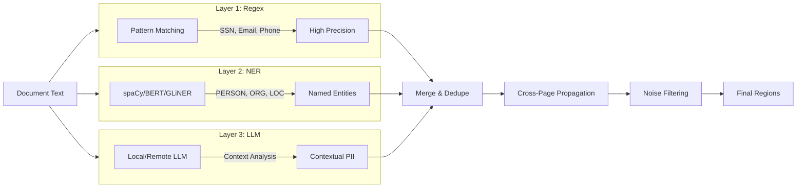
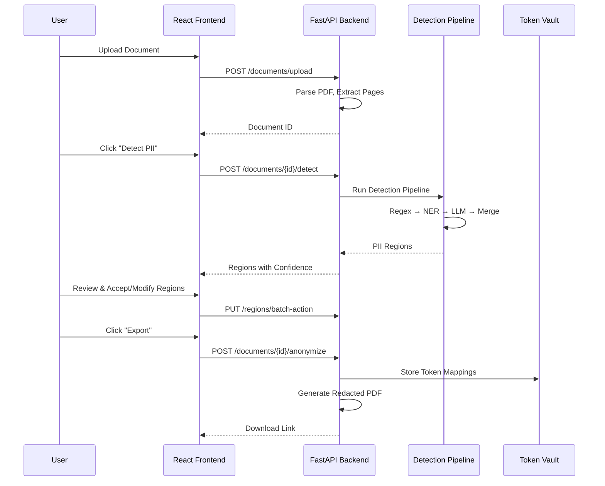
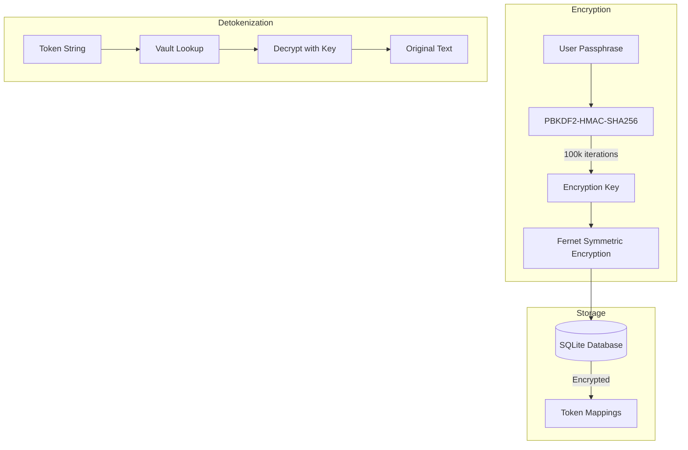

# Document Anonymizer

Offline desktop application for detecting and redacting PII (Personally Identifiable Information) from PDF documents. All processing happens locally — no data ever leaves your machine.

## How It Works

1. **Upload** a PDF document
2. Pages are rendered to bitmaps and (optionally) OCR'd
3. A multi-layer detection pipeline highlights PII regions:
   - **Regex** — SSN, email, phone, credit card, IP, IBAN, passport, driver's license
   - **NER** — spaCy named-entity recognition (person, org, location, date)
   - **LLM** — local LLM for context-aware detection (optional, requires GGUF model)
4. **Review** each highlight: accept, reject, or change the action (remove / tokenize)
5. **Anonymize** — produces a redacted PDF. Tokenized values are stored in an encrypted vault
6. **Detokenize** — restore original values from a token map + vault passphrase

## Architecture

```
┌───────────────────────────────┐
│   Tauri v2 Desktop Shell      │  (Rust — window, menus, sidecar mgmt)
│  ┌─────────────────────────┐  │
│  │  React + TypeScript UI  │  │  Vite, Zustand, Lucide icons
│  └────────┬────────────────┘  │
│           │ HTTP (localhost)   │
│  ┌────────▼────────────────┐  │
│  │  Python FastAPI Sidecar │  │  pypdfium2, spaCy, llama-cpp-python
│  └─────────────────────────┘  │
└───────────────────────────────┘
```

| Layer | Directory | Stack |
|-------|-----------|-------|
| Desktop shell | `frontend/src-tauri/` | Tauri v2, Rust |
| Frontend | `frontend/src/` | React 19, TypeScript 5.9, Vite 7 |
| Backend | `src-python/` | Python 3.11+, FastAPI, pypdfium2, spaCy |

### Detection Pipeline

The PII detection system uses a multi-layer approach for optimal precision and recall:



**Layer Details:**
- **Regex** (fastest): High-precision patterns for SSN, email, phone, credit card, IBAN, dates
- **NER** (balanced): spaCy transformer models for names, organizations, locations
- **LLM** (optional): Context-aware detection using local GGUF models or remote APIs

### Data Flow



### Token Vault Security



### Code Organization

```
src-python/
├── api/
│   ├── server.py          # FastAPI app, middleware, lifespan
│   ├── deps.py            # Shared state, document store
│   ├── repository.py      # DocumentRepository pattern
│   └── routers/           # API endpoint handlers
│       ├── documents.py   # Upload, list, delete (paginated)
│       ├── detection.py   # PII detection, progress
│       ├── regions.py     # Region CRUD, batch ops
│       ├── anonymize.py   # Export, download
│       ├── vault.py       # Token vault management
│       └── llm.py         # Model loading, status
├── core/
│   ├── config.py          # Pydantic app configuration
│   ├── detection/
│   │   ├── pipeline.py    # Detection orchestrator
│   │   ├── detection_config.py  # Centralized constants
│   │   ├── regex_detector.py    # Pattern matching
│   │   ├── ner_detector.py      # spaCy NER
│   │   ├── llm_detector.py      # LLM analysis
│   │   ├── merge.py             # Multi-layer merging
│   │   └── noise_filters.py     # False positive filtering
│   ├── anonymizer/        # Redaction engine
│   ├── ingestion/         # PDF/DOCX parsing
│   ├── ocr/               # Tesseract integration
│   ├── llm/               # GGUF model engine
│   └── vault/             # Encrypted token storage
└── models/
    └── schemas.py         # Pydantic data models
```

### Backend Modules

| Module | Purpose |
|--------|---------|
| `api/server.py` | FastAPI routes (21 endpoints) |
| `core/config.py` | Pydantic-based app configuration |
| `core/detection/` | Regex, NER, and LLM PII detectors |
| `core/ingestion/` | PDF → bitmap conversion (pypdfium2) |
| `core/ocr/` | Tesseract OCR integration |
| `core/llm/` | llama-cpp-python GGUF model engine |
| `core/vault/` | Encrypted token storage (cryptography + SQLite) |
| `core/anonymizer/` | Redaction / tokenization engine |
| `models/schemas.py` | Pydantic request/response schemas |

### Frontend Components

| Component | Purpose |
|-----------|---------|
| `App.tsx` | Shell — sidebar, view routing, backend health poll |
| `Sidebar.tsx` | Navigation + status indicators |
| `UploadView.tsx` | Document upload drop zone |
| `DocumentViewer.tsx` | Page viewer with zoom + page navigation |
| `RegionOverlay.tsx` | PII highlight overlays with action controls |
| `DetokenizeView.tsx` | Token → original value restoration |
| `SettingsView.tsx` | LLM model, OCR, and detection settings |

## Prerequisites

| Requirement | Required? | Notes |
|-------------|-----------|-------|
| **Node.js** ≥ 18 | Yes | Frontend build toolchain |
| **Python** ≥ 3.11 | Yes | Backend runtime |
| **Rust** ≥ 1.70 | For desktop build | Tauri shell compilation |
| **MSVC Build Tools** | For desktop build (Windows) | Rust linker + llama-cpp-python compilation |
| **Tesseract OCR** | Optional | Required only for scanned/image PDFs |
| **GGUF model file** | Optional | Required for LLM detection layer |

### Installing Optional Dependencies

**Tesseract OCR** (Windows):
Download installer from [UB Mannheim](https://github.com/UB-Mannheim/tesseract/wiki) and add to PATH, or set `tesseract_cmd` in Settings.

**GGUF Model** (for LLM detection):
Download any GGUF-format model (e.g., Mistral 7B Q4_K_M) and configure the path in Settings.

**MSVC Build Tools** (Windows):
Install [Visual Studio Build Tools](https://visualstudio.microsoft.com/visual-cpp-build-tools/) with "C++ build tools" workload. Required for `llama-cpp-python` compilation and Tauri `cargo build`.

## Setup

### 1. Python Backend

```bash
cd src-python
python -m venv .venv

# Windows
.venv\Scripts\activate

# macOS / Linux
source .venv/bin/activate

pip install -e .[dev]
python -m spacy download en_core_web_sm
```

For better NER accuracy, use the large model instead:
```bash
python -m spacy download en_core_web_lg
```

### 2. Frontend

```bash
cd frontend
npm install
```

### 3. Tauri Desktop (optional)

Requires Rust and platform build tools (MSVC on Windows, Xcode CLT on macOS).

```bash
cd frontend
npm run tauri:build
```

## Development

### Quick Start

From the project root:

```powershell
# Windows PowerShell
.\dev.ps1

# macOS / Linux
./dev.sh
```

This starts both the Python backend (port 8910) and Vite dev server (port 5173). The Vite proxy forwards API requests to the backend automatically.

### Start Individually

**Backend only:**
```bash
cd src-python
.venv/Scripts/python -u main.py
# → http://127.0.0.1:8910
```

**Frontend only:**
```bash
cd frontend
npm run dev
# → http://localhost:5173
```

**Tauri dev mode** (auto-starts backend as sidecar):
```bash
cd frontend
npm run tauri:dev
```

## Testing

### Backend (pytest)

```bash
cd src-python
.venv/Scripts/python -m pytest tests/ -v
```

28 tests covering regex detection, NER detection, token vault, and API server.

### Frontend (vitest)

```bash
cd frontend
npm test
```

11 tests covering Zustand store logic and type definitions.

## Building for Production

### 1. Bundle the Python Backend

```bash
cd src-python
pip install pyinstaller
pyinstaller doc-anonymizer.spec
```

This produces a single executable in `dist/` with a target-triple name (e.g., `doc-anonymizer-sidecar-x86_64-pc-windows-msvc.exe`) that Tauri expects.

### 2. Build the Desktop App

```bash
cd frontend
npm run tauri:build
```

Produces an installer in `frontend/src-tauri/target/release/bundle/`.

## API Reference

Base URL: `http://127.0.0.1:8910`

| Method | Endpoint | Description |
|--------|----------|-------------|
| GET | `/health` | Health check |
| POST | `/api/documents/upload` | Upload PDF file |
| GET | `/api/documents` | List all documents |
| GET | `/api/documents/{id}` | Get document metadata |
| GET | `/api/documents/{id}/pages/{n}` | Get page metadata |
| GET | `/api/documents/{id}/pages/{n}/bitmap` | Get page bitmap image |
| POST | `/api/documents/{id}/detect` | Run PII detection |
| GET | `/api/documents/{id}/regions` | List detected regions |
| PUT | `/api/documents/{id}/regions/{rid}/action` | Set region action |
| PUT | `/api/documents/{id}/regions/batch-action` | Batch set actions |
| POST | `/api/documents/{id}/regions/add` | Manually add region |
| POST | `/api/documents/{id}/anonymize` | Generate anonymized PDF |
| GET | `/api/documents/{id}/download/{type}` | Download result file |
| POST | `/api/detokenize` | Restore tokenized values |
| POST | `/api/vault/unlock` | Unlock vault with passphrase |
| GET | `/api/vault/status` | Vault lock status |
| GET | `/api/vault/stats` | Vault statistics |
| GET | `/api/vault/tokens` | List stored tokens |
| GET | `/api/llm/status` | LLM engine status |
| POST | `/api/llm/load` | Load GGUF model |
| POST | `/api/llm/unload` | Unload model |

## License

MIT
